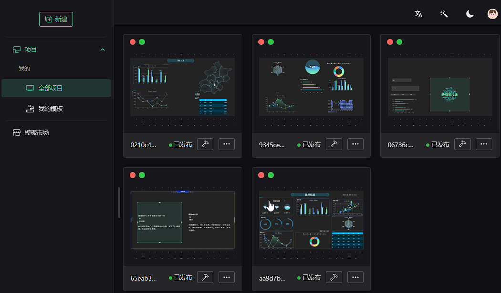
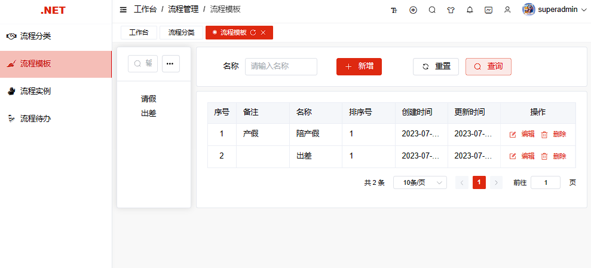

<div align="center"><h1>Fork Admin.NET，谢谢作者</h1></div>
<div align="center"><h3>有可能是.NET最好用的通用权限开发框架</h3></div>

<div align="center">

[](https://gitee.com/zuohuaijun/Admin.NET/stargazers)
[](https://gitee.com/zuohuaijun/Admin.NET/members)
[](https://gitee.com/dotnetchina/Furion/blob/master/LICENSE)

</div>

## 🎁框架介绍
基于.NET6(Furion)/SqlSugar实现的通用权限开发框架，前端Vue3/Element-plus。整合最新技术，模块插件式开发，前后端分离，开箱即用。

内置国密算法，是国内首个.NET中具备国密且前后端分离快速开发平台，软件层面完全符合等保测评和信创要求，同时实现国产化机型、操作系统、中间件、数据库适配！

```
最好用的框架(Furion)配合性能最强的ORM(SqlSugar)加持，阅历痛点，相见恨晚！让 .NET 开发更简单，更通用，更流行！
```

## 🍁说明
1.  支持各种数据库，后台配置文件自行修改（自动生成数据库及种子数据）
2.  前端运行步骤：1、安装依赖pnpm install 2、运行pnpm run dev 3、打包pnpm run build
3.  微信号：zuohuaijun  QQ群1：[87333204](https://jq.qq.com/?_wv=1027&k=1t8iqf0G)  QQ群2：[252381476](https://jq.qq.com/?_wv=1027&k=IkzihDcL)  
4.  演示环境：https://demo.devqd.com/   (不定期重置数据库) 

## 📙开发流程
```bash
1. 建议每个应用系统单独创建一个工程（Admin.NET.Application层只是示例），单独设置各项配置，引用Admin.NET.Core层（非必须不改工程名）

2. Web层引用新建的应用层工程即可（所有应用系统一个解决方案显示一个后台一套代码搞定，可以自由切换不同应用层）

# 可以随主仓库升级而升级避免冲突，原则上接口、服务、控制器合并模式不影响自建应用层发挥与使用。若必须修改或补充主框架，也欢迎PR！

```

## 🍎效果截图
<table>
    <tr>
        <td></td>
        <td></td>
        <td></td>
        <td></td>
    </tr>
    <tr>
        <td></td>
        <td></td>
        <td></td>
        <td></td>
    </tr>
    <tr>
        <td></td>
        <td></td>
        <td></td>
        <td></td>
    </tr>
    <tr>
        <td></td>
        <td></td>
        <td></td>
        <td></td>
    </tr>
</table>

## 🍖内置功能
 1. 主控面板：控制台页面，可进行工作台，分析页，统计等功能的展示。
 2. 用户管理：对企业用户和系统管理员用户的维护，可绑定用户职务，机构，角色，数据权限等。
 3. 机构管理：公司组织架构维护，支持多层级结构的树形结构。
 4. 职位管理：用户职务管理，职务可作为用户的一个标签。
 5. 菜单管理：配置系统菜单，操作权限，按钮权限标识等，包括目录、菜单、按钮。
 6. 角色管理：角色绑定菜单后，可限制相关角色的人员登录系统的功能范围。角色也可以绑定数据授权范围。
 7. 字典管理：对系统中经常使用的一些较为固定的数据进行维护。
 8. 访问日志：用户的登录和退出日志的查看和管理。
 9. 操作日志：系统正常操作日志记录和查询；系统异常信息日志记录和查询。
10. 服务监控：服务器的运行状态，CPU、内存、网络等信息数据的查看。
11. 在线用户：当前系统在线用户的查看，包括强制下线。基于 SignalR 实现。
12. 公告管理：系统通知公告信息发布维护，使用 SignalR 实现对用户实时通知。
13. 文件管理：文件的上传下载查看等操作，文件可使用本地存储，阿里云oss、腾讯cos等接入，支持拓展。
14. 任务调度：采用 Sundial，.NET 功能齐全的开源分布式作业调度系统。
15. 系统配置：系统运行的参数的维护，参数的配置与系统运行机制息息相关。
16. 邮件短信：发送邮件功能、发送短信功能。
17. 系统接口：使用 Swagger 生成相关 api 接口文档。支持 Knife4jUI 皮肤。
18. 代码生成：可以一键生成前后端代码，自定义配置前端展示控件，让开发更快捷高效。
19. 在线构建器：拖动表单元素生成相应的 VUE 代码(支持vue3)。
20. 对接微信：对接微信小程序开发，包括微信支付。
21. 导入导出：采用 Magicodes.IE 支持文件导入导出，支持根据H5模板生成PDF等报告文件。
22. 限流控制：采用 AspNetCoreRateLimit 组件实现对接口访问限制。
23. ES 日志：通过 NEST 组件实现日志存取到 Elasticsearch 日志系统。
24. 开放授权：支持OAuth 2.0开放标准授权登录，比如微信。
25. APIJSON：适配腾讯APIJSON协议，支持后端0代码，[使用文档](https://github.com/liaozb/APIJSON.NET)。

## 🍁扩展说明
1. 新增通讯录和诗集界面。
2. 新增工作流
3. 适配goview大屏前端，在web项目中
4. 采用的sqlsugar没有包含数据库驱动，需要自己去安装对应的nuget包






# 2、GrpcModule
grpc客户端封装类，连接服务端使用


